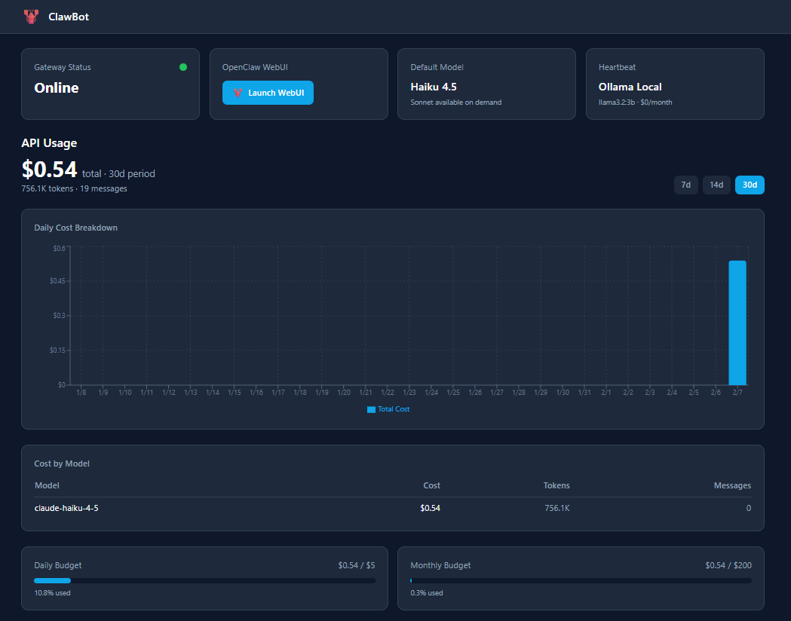

<p align="center">
  
  
  
  
</p>

# 🤖 ClawBot

**Your personal AI assistant, self-hosted on a VPS for ~$30–50/month instead of $1,500+.**

ClawBot is a production-ready, one-command deployment of [OpenClaw](https://github.com/openclaw/openclaw) — a powerful AI agent platform — behind **Traefik** (auto-HTTPS reverse proxy), **Authelia** (single-user auth), and **Ollama** (free local LLM for heartbeats). It includes a custom **Next.js dashboard** for monitoring usage, costs, and model routing in real time.

<p align="center">
  
  <br />
  <em>ClawBot Dashboard — real-time API usage, cost tracking, model breakdown, and budget bars</em>
</p>

---

## ✨ Why ClawBot?

| Problem | ClawBot's Solution |
|---|---|
| OpenClaw with default settings can cost **$1,500+/month** | 6 token optimizations bring it down to **$30–50/month** |
| AI assistants exposed to the internet with no auth | **Authelia** single-user login gate protects all routes |
| No visibility into spend / token usage | **Custom dashboard** with live usage charts and budget bars |
| Heartbeats burn tokens on paid APIs | **Ollama** runs a local LLM — heartbeats cost **$0/month** |
| Complex multi-service setup | **Single `docker compose up -d`** launches everything |

---

## 🏗️ Architecture

```
Internet
  │
  ▼
┌───────────────────────────────────────────────────────┐
│  Traefik  (ports 80/443, auto HTTPS via Let's Encrypt)│
│  ├─ yourdomain.com/           → Dashboard (Next.js)   │
│  ├─ yourdomain.com/openclaw/  → OpenClaw Gateway      │
│  └─ yourdomain.com/authelia/  → Authelia Login Portal │
│                                                       │
│  All routes pass through Authelia ForwardAuth first   │
└───────────────────────────────────────────────────────┘
         │
         ├── Ollama (llama3.2:3b) — free local heartbeats
         └── Persistent volumes at /opt/openclaw/
```

### Services

| Service | Purpose |
|---|---|
| **Traefik** | Reverse proxy, auto HTTPS (Let's Encrypt), security headers, rate limiting |
| **Authelia** | Single-user authentication gate (one-factor) |
| **OpenClaw Gateway** | AI assistant — chat via WebUI or WhatsApp |
| **Dashboard** | Next.js app — status, usage graphs, cost tracking, budget bars |
| **Ollama** | Local LLM (llama3.2:3b) for free heartbeats |

---

## 💰 Token Optimizations

All 6 recommendations from the [OpenClaw Token Optimization Guide](docs/OpenClaw%20Token%20Optimization%20Guide.md) are implemented out of the box:

| # | Optimization | What it does | Savings |
|---|---|---|---|
| 1 | **Session Init** | Load only `SOUL.md` + `USER.md` (~8KB vs 50KB) | 8× cheaper sessions |
| 2 | **Model Routing** | Haiku 4.5 default, Sonnet only when needed | 10–15× cheaper per token |
| 3 | **Heartbeat → Ollama** | Local `llama3.2:3b` instead of paid API | $0/mo vs $5–15/mo |
| 4 | **Rate Limits** | 5s between calls, 10s between searches | Prevents runaway spend |
| 5 | **Budget Controls** | $5/day hard cap, $200/month, 75% warnings | No surprise bills |
| 6 | **Prompt Caching** | `cache-ttl` mode, 5min TTL, auto for Anthropic | 90% discount on cached tokens |

---

## 🔒 Security

- **Authelia ForwardAuth** — every route requires login (no unauthenticated access)
- **Traefik** — HSTS with preload, `X-Robots-Tag: noindex`, `nosniff`, rate limiting (100 req/min)
- **UFW firewall** — only ports 22, 80, 443 open
- **Fail2Ban** — SSH brute-force protection (3 attempts → 1h ban)
- **No direct container exposure** — all traffic routed through Traefik only
- **Secrets in `.env`** — gitignored, never committed
- **Anti-bot** — `robots.txt` blocks all crawlers, `noindex` headers on every response

> Full server hardening guide (SSH, kernel, Docker, auto-updates) → [SERVER-SECURITY.md](docs/SERVER-SECURITY.md)

---

## 🚀 Getting Started

### Prerequisites

- A **VPS** with 2+ cores, 4+ GB RAM (tested on Hostinger KVM 2 — 2 cores, 8 GB RAM, 100 GB NVMe)
- **Ubuntu 22.04+** (or any Linux with Docker)
- A **domain** with an A record pointed to your VPS IP
- An **Anthropic API key** from [console.anthropic.com](https://console.anthropic.com/)
- **Docker** and **Docker Compose** installed ([install guide](https://docs.docker.com/engine/install/ubuntu/))

### 1. Clone & Configure

```bash
git clone https://github.com/YOUR_USERNAME/clawbot.git
cd clawbot
cp .env.example .env
```

Edit `.env` with your values:

| Variable | Description | How to generate |
|---|---|---|
| `DOMAIN` | Your domain (e.g. `example.com`) | Must have an A record pointing to your VPS |
| `ACME_EMAIL` | Email for Let's Encrypt certificates | Any valid email |
| `ANTHROPIC_API_KEY` | Anthropic API key | From [console.anthropic.com](https://console.anthropic.com/) |
| `OPENCLAW_GATEWAY_TOKEN` | Gateway auth token | `openssl rand -hex 32` |
| `AUTHELIA_JWT_SECRET` | Authelia JWT secret | `openssl rand -hex 32` |
| `AUTHELIA_SESSION_SECRET` | Authelia session secret | `openssl rand -hex 32` |
| `AUTHELIA_STORAGE_ENCRYPTION_KEY` | Storage encryption key | `openssl rand -hex 32` |
| `WHATSAPP_NUMBER` | *(optional)* Your WhatsApp number | For WhatsApp channel |

### 2. Set Up Authentication

```bash
# Copy the example users file
cp authelia/users.yml.example authelia/users.yml

# Generate an argon2 password hash
docker run --rm authelia/authelia:latest \
  authelia crypto hash generate argon2 --password 'YOUR_SECURE_PASSWORD'

# Edit authelia/users.yml — paste the hash into the "password" field and set your email
nano authelia/users.yml
```

### 3. Personalize Your AI Agent *(optional but recommended)*

Edit `openclaw/workspace/USER.md` with your name, timezone, and communication preferences. This file is loaded at every session start to give the AI context about you.

```bash
nano openclaw/workspace/USER.md
```

### 4. Launch

```bash
# Start the full stack
docker compose up -d

# Pull the local Ollama model (first time only, ~2 GB)
docker exec ollama ollama pull llama3.2:3b
```

Wait 1–2 minutes for all services to start, then visit:

| URL | What |
|---|---|
| `https://yourdomain.com/` | 📊 Dashboard (login required) |
| `https://yourdomain.com/openclaw/` | 💬 OpenClaw WebUI (login required) |
| `https://yourdomain.com/authelia/` | 🔑 Authelia login portal |

---

## 📁 Project Structure

```
clawbot/
├── docker-compose.yml            # Full stack definition
├── .env.example                  # Template for secrets (copy to .env)
├── .gitignore
│
├── traefik/
│   ├── traefik.yml               # Entrypoints, ACME, providers
│   ├── dynamic/middlewares.yml   # ForwardAuth, security headers, rate limit
│   └── robots.txt                # Disallow all crawlers
│
├── authelia/
│   ├── configuration.yml         # Auth config (reads DOMAIN from .env automatically)
│   ├── users.yml.example         # Template — copy to users.yml & set password hash
│   └── users.yml                 # ⛔ Gitignored — your credentials
│
├── openclaw/
│   ├── Dockerfile                # Builds OpenClaw from npm (node:22-slim)
│   ├── openclaw.json             # Model routing, heartbeat, caching config
│   └── workspace/
│       ├── SOUL.md               # Agent principles, model rules, budget rules
│       └── USER.md               # Your preferences, timezone, style
│
├── dashboard/
│   ├── Dockerfile                # Multi-stage Next.js build (node:22-alpine)
│   ├── package.json
│   └── src/                      # Status cards, usage charts, budget bars
│
└── docs/
    ├── OpenClaw Token Optimization Guide.md
    ├── OpenClaw Workspace & Skills Guide.md
    └── SERVER-SECURITY.md        # Full VPS hardening reference
```

### Persistent Data (stored on host, outside the repo)

| Path | Purpose |
|---|---|
| `/opt/openclaw/config/` | OpenClaw config, session transcripts, logs |
| `/opt/openclaw/workspace/` | SOUL.md, USER.md, memory files |
| Docker volume `authelia-data` | Authelia SQLite DB |
| Docker volume `ollama-data` | Ollama model weights (~2 GB) |
| Docker volume `traefik-certs` | Let's Encrypt certificates |
| Docker volume `traefik-logs` | Traefik access & error logs |

---

## 🛠️ Common Commands

```bash
# Start / stop the stack
docker compose up -d
docker compose down

# View service logs
docker logs -f openclaw-gateway
docker logs -f traefik
docker logs -f authelia

# Restart a single service
docker compose restart openclaw-gateway

# Rebuild after code changes
docker compose build dashboard && docker compose up -d dashboard

# Update OpenClaw config
cp openclaw/openclaw.json /opt/openclaw/config/openclaw.json
chown 1000:1000 /opt/openclaw/config/openclaw.json
docker compose restart openclaw-gateway

# Change Authelia password
docker run --rm authelia/authelia:latest \
  authelia crypto hash generate argon2 --password 'NEW_PASSWORD'
# Paste into authelia/users.yml → password field, then:
docker compose restart authelia
```

---

## ✅ What Works Out of the Box

| Feature | Status |
|---|---|
| Traefik routing + auto HTTPS | ✅ Zero config needed |
| Authelia auth gateway | ✅ Just set your password hash |
| Model routing (Haiku ↔ Sonnet) | ✅ Pre-configured in `openclaw.json` |
| Heartbeats via local Ollama | ✅ Just pull the model once |
| Budget controls & rate limits | ✅ Enforced via `SOUL.md` |
| Prompt caching (90% savings) | ✅ Enabled in `openclaw.json` |
| Security headers + rate limiting | ✅ Traefik middlewares |

**You only need to customize:** `.env` (secrets/domain), `users.yml` (password), and optionally `USER.md` (personality).

---

## 📖 Documentation

| Guide | Description |
|---|---|
| [Token Optimization Guide](docs/OpenClaw%20Token%20Optimization%20Guide.md) | Detailed cost analysis — how we went from $1,500/mo to $30–50/mo |
| [Workspace & Skills Guide](docs/OpenClaw%20Workspace%20%26%20Skills%20Guide.md) | How to customize agent personality, skills, and memory |
| [Server Security](docs/SERVER-SECURITY.md) | Full VPS hardening — SSH, UFW, Fail2Ban, kernel, Docker |

---

## ⚙️ System Requirements

| Resource | Minimum | Recommended |
|---|---|---|
| CPU | 2 cores | 2+ cores |
| RAM | 4 GB | 8 GB (Ollama loads model into RAM) |
| Disk | 20 GB | 50+ GB |
| OS | Ubuntu 22.04+ | Ubuntu 24.04 LTS |

---

## 📄 License

MIT — use it, fork it, deploy it.

---

<p align="center">
  Built with <a href="https://github.com/openclaw/openclaw">OpenClaw</a> · <a href="https://traefik.io/">Traefik</a> · <a href="https://www.authelia.com/">Authelia</a> · <a href="https://ollama.ai/">Ollama</a> · <a href="https://nextjs.org/">Next.js</a>
</p>
